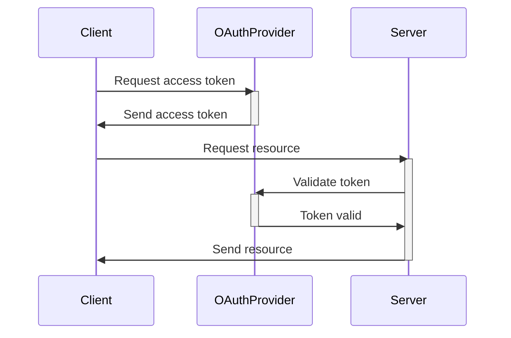
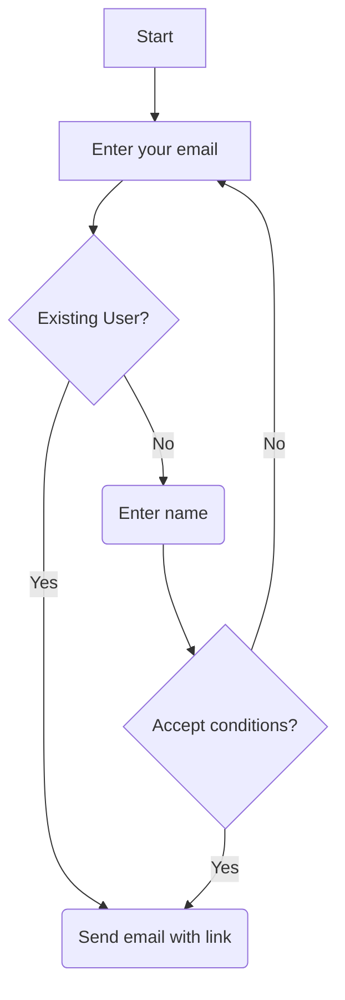

# Mermaid tutorial

Let's go

## Sequence Diagram Sample

```mermaid
sequenceDiagram
   participant Client
   participant OAuthProvider
   participant Server
   Client->>OAuthProvider: Request access token
   activate OAuthProvider
   OAuthProvider->>Client: Send access token
   deactivate OAuthProvider
   Client->>Server: Request resource
   activate Server
   Server->>OAuthProvider: Validate token
   activate OAuthProvider
   OAuthProvider->>Server: Token valid
   deactivate OAuthProvider
   Server->>Client: Send resource
   deactivate Server
```

## Flowchart Sample

```mermaid
flowchart
    S[Start] --> A[Enter your email];
    A --> B{Existing User?};
    B --> |No| C(Enter name);
    B --> |Yes| E;
    C --> D{Accept conditions?}
    D -->|Yes| E(Send email with link)
    D -->|No| A
```
