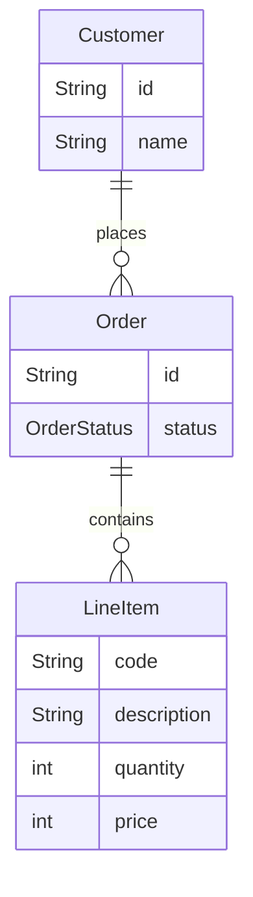
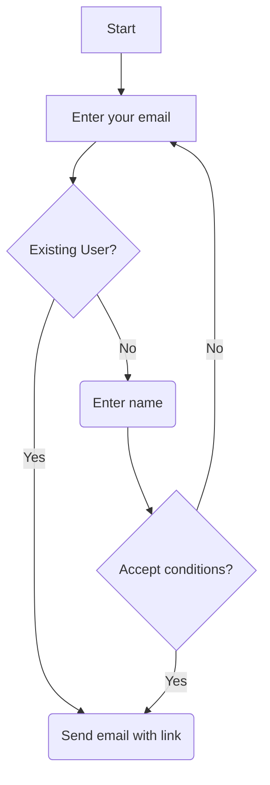
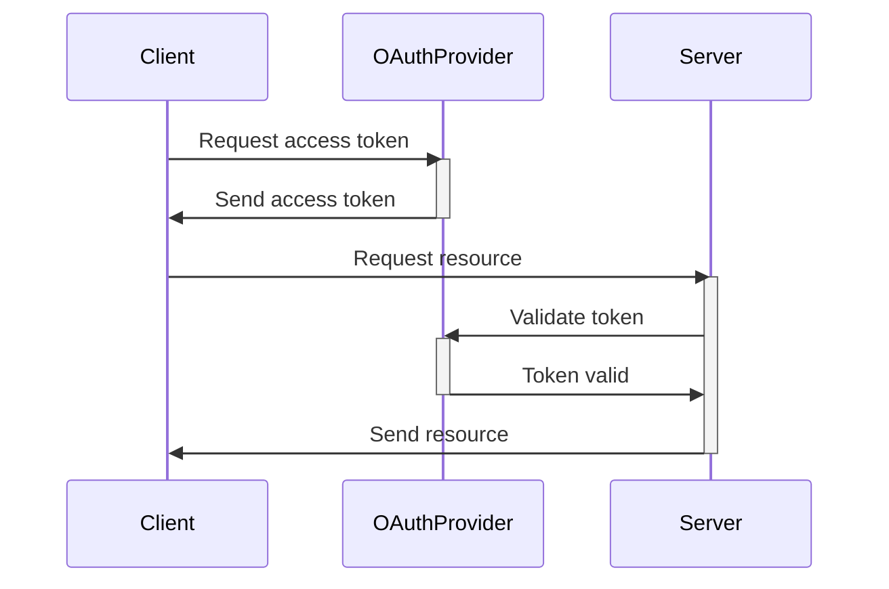
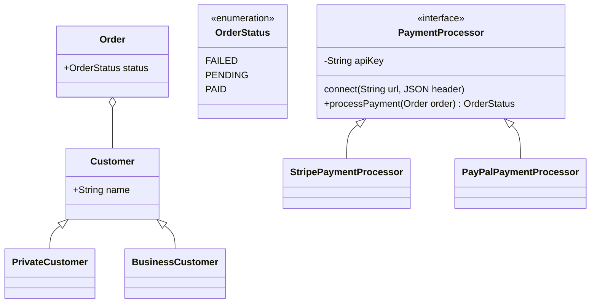

# Mermaid tutorial

The Mermaid Live Editor can be found at [mermaid.live](https://mermaid.live)

## Entity Relationship Diagram

## Flowchart Sample

## Sequence Diagram Sample

Some text in between the diagrams

## Class Diagram Sample

